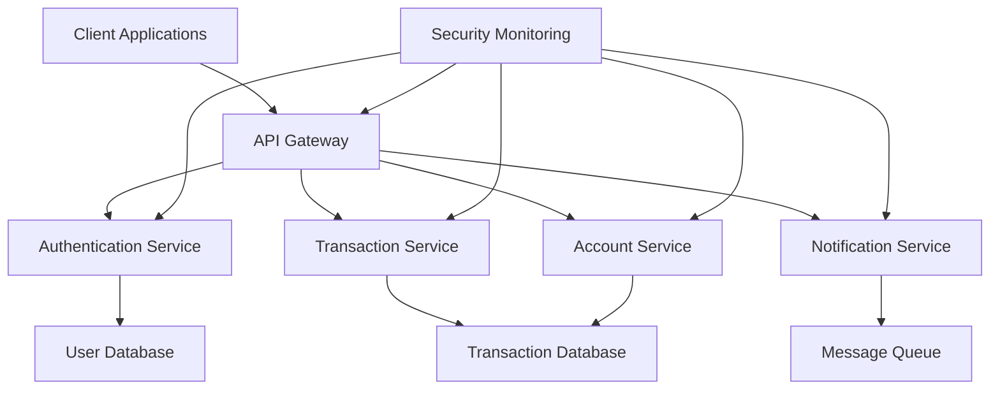

# CozyCredit Banking Application
## Introduction
CozyCredit is a modern, secure banking application designed to provide customers with a seamless and intuitive banking experience. This document provides an overview of the application's features, architecture, and robust security and availability frameworks that ensure reliable and protected financial services.
## Overview of CozyCredit Banking Application
CozyCredit is a comprehensive digital banking solution that enables customers to manage their finances, perform transactions, and access various banking services through web and mobile interfaces. The application is built with a focus on security, availability, and user experience, making it an ideal choice for customers seeking a trustworthy banking partner in the digital age.
## Key Features
### User Experience Features
- **Intuitive Interface**: Clean, modern design with straightforward navigation
- **Personalized Dashboard**: Customizable view of accounts, recent transactions, and financial insights
- **Smart Notifications**: Real-time alerts for account activities, upcoming payments, and security concerns
- **Seamless Onboarding**: Quick and easy account setup process with minimal documentation
- **Biometric Authentication**: Secure login using fingerprint or facial recognition
### Banking Services
- **Account Management**: View balances, statements, and transaction history
- **Fund Transfers**: Domestic and international transfers with competitive exchange rates
- **Bill Payments**: Schedule one-time or recurring payments to service providers
- **Loan Services**: Apply for personal, home, or auto loans with instant pre-approval
- **Investment Options**: Access to various investment products and portfolio management tools
- **Budgeting Tools**: Expense tracking, categorization, and financial goal setting
### Mobile and Web Access
- **Cross-Platform Compatibility**: Seamless experience across desktop, tablet, and mobile devices
- **Offline Capabilities**: Basic account information accessible without internet connection
- **Quick Actions**: Frequently used features accessible with minimal navigation
- **Voice Commands**: Hands-free banking operations through voice recognition
## Technical Architecture
### VM/Kubernetes Deployment
CozyCredit is deployed on a robust VM/Kubernetes environment, ensuring:
- **Scalability**: Ability to handle varying loads efficiently
- **High Availability**: Redundant systems to minimize downtime
- **Disaster Recovery**: Regular backups and failover mechanisms
- **Resource Optimization**: Efficient allocation of computing resources
### System Components

- **Frontend Layer**: Responsive web and mobile interfaces
- **API Gateway**: Central entry point for all client requests with security filtering
- **Microservices**: Specialized services for different banking functions
- **Data Layer**: Secure databases with encryption and redundancy
- **Integration Layer**: Connections to external systems and partners
### High Availability Design
CozyCredit's architecture is designed for maximum uptime and reliability:
- **Active-Active Configuration**: Multiple instances running simultaneously across different availability zones
- **Load Balancing**: Intelligent distribution of traffic to prevent overloading
- **Auto-Scaling**: Dynamic resource allocation based on demand
- **Geographic Redundancy**: Data centers in multiple regions to mitigate regional outages
- **Zero-Downtime Deployments**: Updates and maintenance without service interruption
## Security Framework
### Multi-layered Security Approach
CozyCredit implements a defense-in-depth strategy with multiple security layers:
- **Perimeter Security**: Advanced firewalls and DDoS protection
- **Network Security**: Segmentation, encryption, and intrusion detection
- **Application Security**: Secure coding practices and regular vulnerability scanning
- **Data Security**: Encryption at rest and in transit
- **Endpoint Security**: Device verification and malware protection
- **Physical Security**: Secure data centers with restricted access
### Authentication and Authorization
- **Multi-Factor Authentication**: Combination of something you know, have, and are
- **Risk-Based Authentication**: Additional verification for unusual activities
- **Role-Based Access Control**: Granular permissions based on user roles
- **Session Management**: Automatic timeouts and secure session handling
- **Single Sign-On**: Secure access across services with one authentication
- **Behavioral Biometrics**: Analysis of typing patterns and interaction habits
### Data Protection and Encryption
- **End-to-End Encryption**: All data encrypted during transmission
- **AES-256 Encryption**: Bank-grade encryption for stored data
- **Tokenization**: Sensitive data replaced with non-sensitive tokens
- **Data Masking**: Partial display of sensitive information
- **Secure Key Management**: Hardware security modules for cryptographic keys
- **Data Loss Prevention**: Controls to prevent unauthorized data exfiltration
### Certificate Management
Certificate management is a critical aspect of CozyCredit's security framework:
- **Automated Certificate Monitoring**: Continuous monitoring of all SSL/TLS certificates
- **Expiry Alerts**: Proactive notifications for certificates nearing expiration
- **Renewal Workflow**: Streamlined process for certificate renewal and deployment
- **Validation Checks**: Regular verification of certificate validity and configuration
- **Certificate Pinning**: Protection against man-in-the-middle attacks
- **Extended Validation Certificates**: Enhanced verification for critical services
### Threat Detection and Prevention
- **Real-time Monitoring**: Continuous surveillance of all system activities
- **AI-Powered Anomaly Detection**: Machine learning algorithms to identify unusual patterns
- **Fraud Detection Systems**: Advanced analytics to prevent fraudulent transactions
- **Vulnerability Management**: Regular scanning and prompt patching
- **Penetration Testing**: Scheduled and random security testing by ethical hackers
- **Security Information and Event Management (SIEM)**: Centralized security event analysis
### Compliance and Auditing
- **Regulatory Compliance**: Adherence to PCI DSS, GDPR, SOX, and other relevant regulations
- **Comprehensive Audit Trails**: Detailed logs of all system activities
- **Regular Security Audits**: Internal and external security assessments
- **Compliance Reporting**: Automated generation of compliance reports
- **Third-Party Risk Management**: Assessment and monitoring of vendor security
- **Security Certifications**: ISO 27001, SOC 2, and other industry certifications
## Availability and Reliability
### Redundancy and Failover Systems
- **N+1 Redundancy**: Extra components beyond minimum requirements
- **Automatic Failover**: Seamless transition to backup systems
- **Database Replication**: Real-time synchronization across multiple database instances
- **Redundant Network Paths**: Multiple routes for network traffic
- **Power Redundancy**: Uninterruptible power supplies and backup generators
- **Component Isolation**: Failures contained without affecting entire system
### Disaster Recovery
- **Comprehensive Disaster Recovery Plan**: Documented procedures for various scenarios
- **Regular DR Drills**: Scheduled testing of recovery procedures
- **Recovery Point Objective (RPO)**: Minimal data loss target of less than 5 minutes
- **Recovery Time Objective (RTO)**: Service restoration target of less than 30 minutes
- **Off-site Backups**: Data stored in geographically distant locations
- **Automated Recovery Procedures**: Minimized human intervention during recovery
### Performance Optimization
- **Content Delivery Network**: Distributed delivery of static content
- **Database Optimization**: Indexing, caching, and query optimization
- **Code Efficiency**: Regular performance reviews and optimizations
- **Resource Scaling**: Automatic adjustment based on performance metrics
- **Caching Strategies**: Multi-level caching to reduce database load
- **Asynchronous Processing**: Non-critical operations handled outside request cycle
### Monitoring and Alerting
- **24/7 System Monitoring**: Continuous observation of all critical components
- **Real-time Alerting**: Immediate notification of issues to response teams
- **Performance Metrics**: Tracking of response times, throughput, and resource utilization
- **User Experience Monitoring**: Synthetic transactions to verify end-to-end functionality
- **Predictive Analytics**: Early warning of potential issues before they impact users
- **Centralized Logging**: Aggregation of logs from all system components
### Service Level Agreements
- **Uptime Guarantee**: 99.99% availability commitment
- **Performance Benchmarks**: Guaranteed response times for different operations
- **Incident Response Times**: Defined timeframes for addressing different severity levels
- **Maintenance Windows**: Scheduled downtime limited to non-peak hours
- **Compensation Policy**: Clear terms for SLA violations
- **Transparent Reporting**: Regular publication of actual performance against SLAs
## User Experience Design
### Interface Overview
CozyCredit's interface is designed with the following principles:
- **Clarity**: Clear presentation of information without clutter
- **Consistency**: Uniform design patterns across all features
- **Efficiency**: Minimal steps required to complete common tasks
- **Feedback**: Immediate response to user actions
- **Security Visibility**: Clear indicators of security status and protections
### Accessibility Features
- **Screen Reader Compatibility**: Full support for visually impaired users
- **Keyboard Navigation**: Complete functionality without mouse input
- **Color Contrast**: Optimized for users with color vision deficiencies
- **Text Scaling**: Adjustable text size without layout disruption
- **Language Options**: Support for multiple languages
- **Voice Commands**: Hands-free operation for users with mobility limitations
### Customer Journey

The application guides users through a carefully designed journey:
1. **Discovery**: Introduction to key features and benefits
2. **Onboarding**: Streamlined account creation and verification with security education
3. **Adoption**: Guided exploration of basic banking functions
4. **Expansion**: Introduction to advanced features based on usage patterns
5. **Engagement**: Regular updates and personalized recommendations
## Future Roadmap
CozyCredit is continuously evolving with planned enhancements:
- **Advanced Biometric Security**: Additional biometric authentication methods
- **AI-Powered Financial Advisor**: Personalized financial guidance based on spending patterns
- **Expanded Payment Options**: Integration with emerging payment technologies
- **Enhanced Security Features**: Additional layers of protection against evolving threats
- **Community Banking Features**: Collaborative saving and investment opportunities
- **Sustainability Insights**: Environmental impact tracking for financial decisions
- **Quantum-Resistant Cryptography**: Preparation for post-quantum security challenges
## Conclusion
CozyCredit represents a modern approach to digital banking, combining robust security measures and high availability with an exceptional user experience. The application's multi-layered security framework and comprehensive availability design ensure that customers can access their financial services securely and reliably at all times.
The application's focus on continuous improvement, both in terms of security, availability, and user experience, positions it as a leader in the digital banking space, ready to adapt to changing customer needs, emerging technologies, and evolving security threats.
